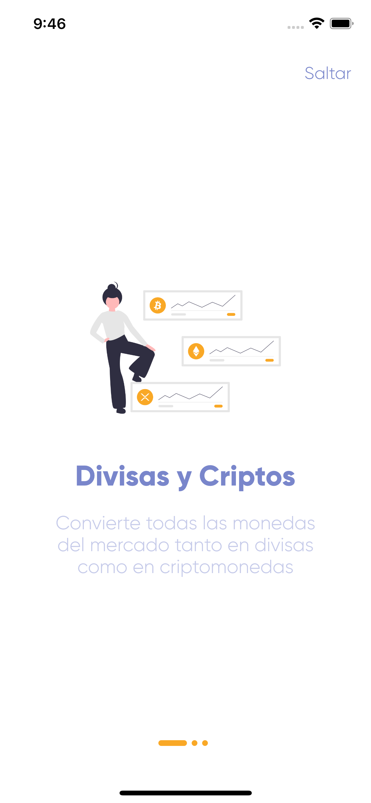
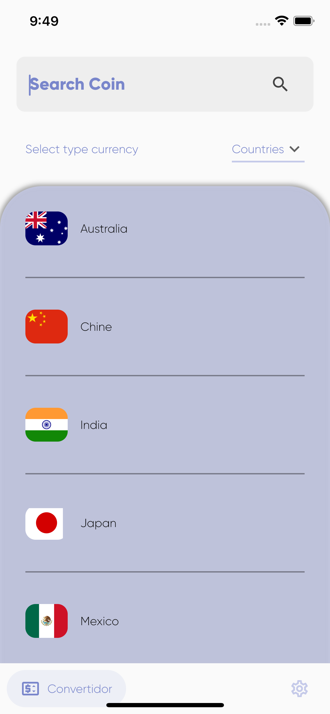
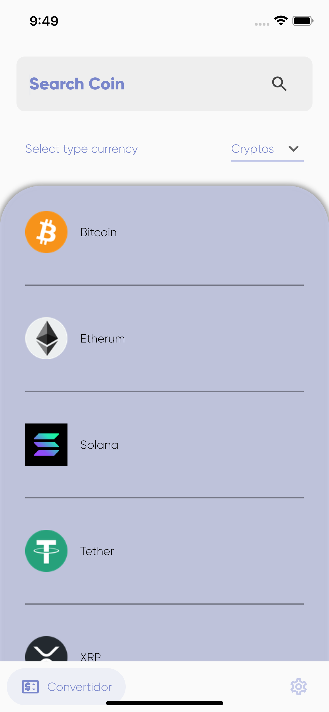
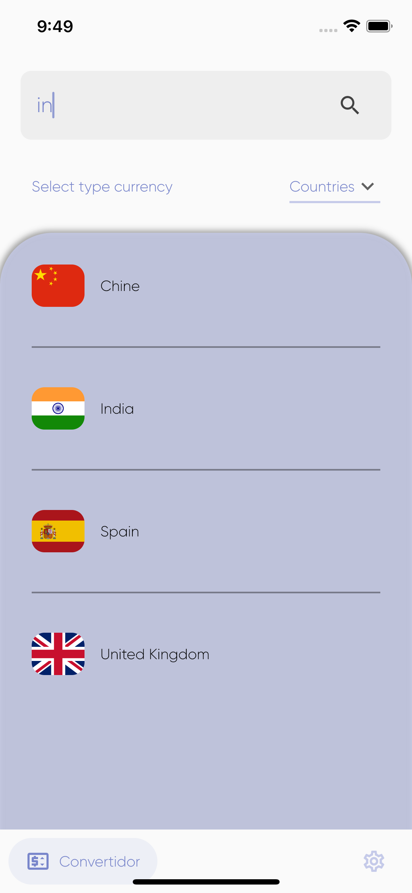
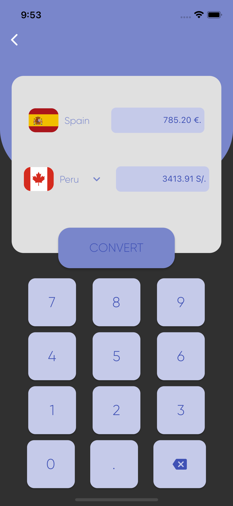
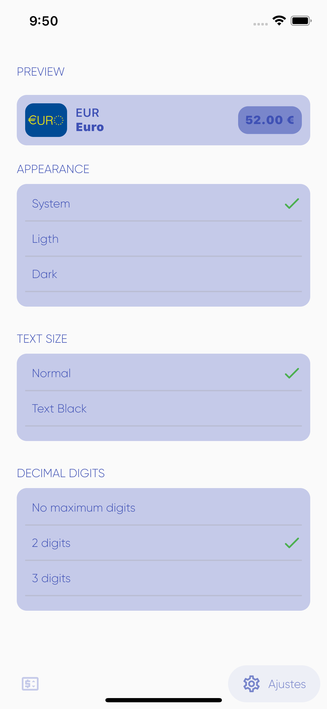
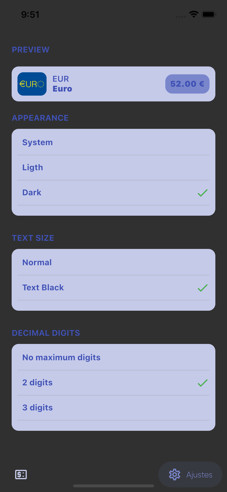

# Convertidor de divisas y criptomonedas

- ## Descripción
    - Aplicación que convierte divisas y criptomonedas usando como base de datos firebase. 

# Funcionalidad de la aplicación

- ApiRest de FireBase Endpoints aqui obtendremos cada moneda.

> ## GET: Obteniendo las divisas
---
```https 
https://wallet-46c79-default-rtdb.europe-west1.firebasedatabase.app/coins_countries.json
```

```json
{
    "-Muohl2PKCfamWwbyfWE": {
        "code_flag": "US",
        "name": "United States",
        "rate": 0.89,
        "symbol": "$"
    },
    "-MuojVd6zDOxU0k95ko0": {
        "code_flag": "ES",
        "name": "Spain",
        "rate": 1.0,
        "symbol": "€"
    },
    "-MuoksHQXfKtll1se_h8": {
        "code_flag": "CA",
        "name": "Peru",
        "rate": 0.23,
        "symbol": "S/"
    },
    "-Muolvd8SyXKrwdRD-u7": {
        "code_flag": "GB",
        "name": "United Kingdom",
        "rate": 0.83,
        "symbol": "£"
    },
    "-MupBbd-7vGaBwJ_qwN-": {
        "code_flag": "JP",
        "name": "Japan",
        "rate": 0.0077,
        "symbol": "¥"
    },
    "-MupBxn3th6p1akwaav6": {
        "code_flag": "AU",
        "name": "Australia",
        "rate": 0.63,
        "symbol": "$"
    },
    "-MupCV7bJhYKvVhwMKb6": {
        "code_flag": "MX",
        "name": "Mexico",
        "rate": 0.043,
        "symbol": "$"
    },
    "-MvF8YruIZBhEQF0xUQB": {
        "code_flag": "CN",
        "name": "Chine",
        "rate": 0.1373,
        "symbol": "元"
    },
    "-MvF99V6VBERwmSJvrKS": {
        "code_flag": "CH",
        "name": "Swiss",
        "rate": 0.9433,
        "symbol": "CHF"
    },
    "-MvFAlRHoOLIcx4MHrIo": {
        "code_flag": "IN",
        "name": "India",
        "rate": 0.012,
        "symbol": "₹"
    }
}
```

> ## GET: Obteniendo las criptomonedas
---

```http
https://wallet-46c79-default-rtdb.europe-west1.firebasedatabase.app/coins_cryptos.json

```

```json
{
    "-MvFOD5NR8X7zWYkQgAn": {
        "code_flag": "https://s2.coinmarketcap.com/static/img/coins/64x64/1.png",
        "name": "Bitcoin",
        "rate": 36.307,
        "symbol": "BTC"
    },
    "-MvFODvj0TazxktRQUXP": {
        "code_flag": "https://s2.coinmarketcap.com/static/img/coins/64x64/1027.png",
        "name": "Etherum",
        "rate": 2.612,
        "symbol": "ETH"
    },
    "-MvFOONlqoehZIRcdpZC": {
        "code_flag": "https://s2.coinmarketcap.com/static/img/coins/64x64/825.png",
        "name": "Tether",
        "rate": 0.8739,
        "symbol": "USDT"
    },
    "-MvFOcU8vv217FwChlt3": {
        "code_flag": "https://s2.coinmarketcap.com/static/img/coins/64x64/5426.png",
        "name": "Solana",
        "rate": 98.23,
        "symbol": "SOL"
    },
    "-MvFOqnPqSe_FbgRqb6d": {
        "code_flag": "https://s2.coinmarketcap.com/static/img/coins/64x64/52.png",
        "name": "XRP",
        "rate": 0.5829,
        "symbol": "XRP"
    }
}
```

> ## GET: Obteniendo datos del dispositivo registrado
    - Aqui obtenendremos las preferencias de nuestro dispositvo que se registre.

```http
https://wallet-46c79-default-rtdb.europe-west1.firebasedatabase.app/devices/428c597b3f96e8ae.json
```

```json
{
    "isFirstView": false,
    "numberDigits": 2,
    "textStyle": "normal",
    "theme": "system"
}
```

### Screenshots de la aplicación

- Intro



- Home Coin Countries



- Home Coin Cryptos



- Search



- Converter



- Settings



